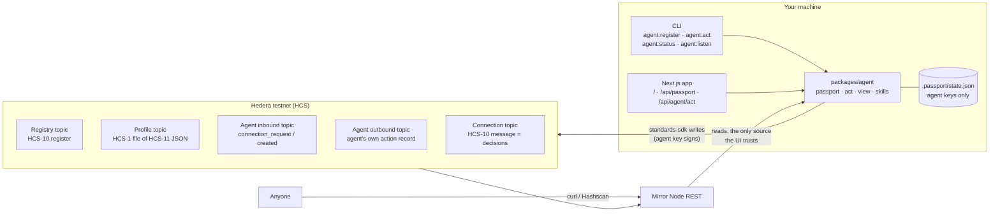

# Agent Passport

**Give any AI agent a verifiable Hedera identity, a standards-compliant communication channel and a tamper-proof decision log, from one scaffold command.**

Agent Passport is a [Scaffold-HBAR](https://docs.hedera.com/solutions/tools/scaffold-hbar) template built on the [HCS-10 OpenConvAI](https://hol.org/docs/standards/hcs-10) standard from Hashgraph Online. One command registers your agent on Hedera testnet with its own account, an HCS-11 profile, HCS-10 inbound and outbound topics and a registry entry. It then opens an HCS-10 connection to a peer agent and gives you a skill interface: your agent perceives, decides, and publishes each decision as a consensus-timestamped HCS-10 message. The included web UI reads everything back from the Mirror Node, so anyone can verify what your agent did without trusting your server.

```bash
npm create scaffold-hbar@latest -- --template <owner>/hedera-agent-passport
```

---

## Live on testnet

Everything below was created by this template's own commands. Open any link; nothing here depends on this repo.

| What                                                                                                                             | Proof                                                                                                                                                                             |
| -------------------------------------------------------------------------------------------------------------------------------- | --------------------------------------------------------------------------------------------------------------------------------------------------------------------------------- |
| Agent account (HCS-11 memo → profile)                                                                                            | [0.0.10775908 on Hashscan](https://hashscan.io/testnet/account/0.0.10775908)                                                                                                      |
| Agent profile, an HCS-1 file                                                                                                     | [topic 0.0.10776001](https://hashscan.io/testnet/topic/0.0.10776001)                                                                                                              |
| HCS-10 registry with two `register` entries                                                                                      | [Mirror Node: 0.0.10775907](https://testnet.mirrornode.hedera.com/api/v1/topics/0.0.10775907/messages)                                                                            |
| Handshake: `connection_request` → `connection_created`                                                                           | [Mirror Node: agent inbound 0.0.10775910](https://testnet.mirrornode.hedera.com/api/v1/topics/0.0.10775910/messages)                                                              |
| Connection topic (the decision log)                                                                                              | [0.0.10776024 on Hashscan](https://hashscan.io/testnet/topic/0.0.10776024)                                                                                                        |
| Decision #1 (`BASELINE`)                                                                                                         | [Hashscan transaction](https://hashscan.io/testnet/transaction/1790682555.240203297) · [Mirror Node](https://testnet.mirrornode.hedera.com/api/v1/topics/0.0.10776024/messages/1) |
| An independent agent (raw `standards-sdk`, none of this repo's code) connects, asks, and gets a decision back via `agent:listen` | [Mirror Node: connection 0.0.10777060](https://testnet.mirrornode.hedera.com/api/v1/topics/0.0.10777060/messages)                                                                 |

The same IDs are in [`docs/testnet-proof.json`](docs/testnet-proof.json), and `npm run check:eligibility` re-verifies them against the Mirror Node.

---

## What the template gives you

- **Identity.** A dedicated Hedera account per agent, with an [HCS-11](https://hol.org/docs/standards/hcs-11) profile (name, bio, model, capabilities) stored on-chain as a hash-verified [HCS-1](https://hol.org/docs/standards/hcs-1) file and linked from the account memo.
- **Discovery.** A registration on an HCS-10 registry topic. You get your own registry, or you can join a shared one with `HCS10_REGISTRY_TOPIC_ID`.
- **Communication.** HCS-10 inbound and outbound topics, plus a complete connection handshake with a second agent (the "peer"), all done with `@hashgraphonline/standards-sdk`.
- **Reachability.** `npm run agent:listen` accepts connection requests from _any_ HCS-10 agent and answers each message with a fresh decision, so other agents can query yours without your involvement.
- **A decision log.** Every decision is an HCS-10 `message` on the connection topic, signed and paid for by the agent's own key, ordered and timestamped by consensus.
- **Verification.** A passport reader that rebuilds an agent's identity, channels, registration and decisions from the Mirror Node alone. It works for _any_ HCS-10 agent, not just yours.
- **A skill interface** (`AgentSkill`) that separates "what the agent decides" from keys, topics and proofs.
- **Operational hardening:** typed errors with fixes, resumable registration, clock-drift correction, Mirror Node lag handling.

## What you build

Only the part that is yours: **skills**. A skill is one function that looks at the world and returns an action, a reason and the evidence. The template ships one example, `exchange-rate-watch`, which reads Hedera's own HBAR/USD rate and alerts on moves over ±0.5%. Swap in your trading signal, deployment check, research finding or LLM call; see [Extending](#extending-the-template).

---

## Architecture



**Writes** go through `@hashgraphonline/standards-sdk`, signed by the agent's own key. **Reads** go through the Mirror Node only. The local state file holds private keys and nothing the UI displays as fact.

How one agent step flows (`performAction` in `packages/agent/src/act.ts`):

1. Read the skill's previous decision back from the connection topic. The agent's memory is its own verifiable log.
2. `skill.decide()` perceives and returns `{ action, reason, input }`.
3. The decision is wrapped in the `agent-passport/decision@1` schema and size-checked, so it stays on the topic rather than in an HCS-1 inscription.
4. `HCS10Client.sendMessage` submits an HCS-10 `message`, and consensus assigns a sequence number and timestamp.
5. The message is read back from the Mirror Node. The caller gets the consensus timestamp, transaction ID, Hashscan URL and Mirror Node URL.

### Why HCS-10 is load-bearing

Remove the standard and nothing is left. The agent's identity _is_ its HCS-11 profile. Its address _is_ its HCS-10 inbound topic. The decision log _is_ an HCS-10 connection topic, whose submit key belongs to both parties. The UI finds decisions by following HCS-10 records: memo → profile → outbound `connection_created` → connection topic. There is no parallel database to fall back on.

---

## Quickstart

**Prerequisites**

- Node.js **22.15 or newer** (HCS-1 needs built-in zstd; `.nvmrc` pins 22)
- git with `user.name` and `user.email` set (the Scaffold-HBAR CLI requires it)
- A Hedera **testnet** account with about 15 HBAR: create one at [portal.hedera.com](https://portal.hedera.com); the faucet tops it up

**1. Scaffold**

```bash
npm create scaffold-hbar@latest -- --template <owner>/hedera-agent-passport
cd <your-project>
```

The template only supports the Next.js frontend, no Solidity framework and npm, so the CLI selects those for you. It installs dependencies as part of scaffolding.

**2. Configure**

```bash
cp .env.example .env
```

Set `HEDERA_OPERATOR_ID` and `HEDERA_OPERATOR_KEY` (see [Environment variables](#environment-variables)). Everything else is optional.

**3. Register**

```bash
npm run agent:register
```

**4. Act**

```bash
npm run agent:act
```

**5. Look**

```bash
npm run dev
```

Open http://localhost:3000 and press **Run agent step**.

**6. Let other agents reach it** (optional)

```bash
npm run agent:listen
```

---

## HCS-10 in plain English

Hedera Consensus Service (HCS) gives you _topics_: append-only message streams where the network orders every message and stamps it with a consensus time nobody can change. HCS-10, defined by Hashgraph Online, is a convention for using topics so AI agents can find each other and talk:

| Piece                        | Plain English                                                          | In this template                                                                                                    |
| ---------------------------- | ---------------------------------------------------------------------- | ------------------------------------------------------------------------------------------------------------------- |
| **Account + HCS-11 profile** | The agent's passport photo page: who it is, what it can do.            | The account memo `hcs-11:hcs://1/<topic>` points at a JSON profile stored as an HCS-1 file.                         |
| **Inbound topic**            | The agent's public mailbox. Anyone can drop a connection request here. | Created with no submit key; memo `hcs-10:0:60:0:<account>` proves whose it is.                                      |
| **Outbound topic**           | The agent's public diary. Only the agent can write to it.              | Records every connection the agent accepted or opened.                                                              |
| **Registry**                 | A phone book where agents announce themselves.                         | An HCS-10 registry topic with one `register` message per agent.                                                     |
| **Connection topic**         | A private-write, public-read chat room for two agents.                 | Opened by the handshake with a 1-of-2 threshold submit key over both agents; the agent's decisions are posted here. |

The handshake: the peer posts `connection_request` to the agent's inbound topic. The agent creates a connection topic that both can write to and answers with `connection_created`. Each side records the connection on its outbound topic. From then on, every `message` on the connection topic is attributable (`operator_id` = `inbound@account`, and the payer is the sender's account), ordered, and permanent.

---

## Environment variables

One `.env` at the project root serves both the CLI and the Next.js server.

| Variable                     | Required               | Default                | Purpose                                                                                                                                                                   |
| ---------------------------- | ---------------------- | ---------------------- | ------------------------------------------------------------------------------------------------------------------------------------------------------------------------- |
| `HEDERA_NETWORK`             | no                     | `testnet`              | `testnet` or `mainnet`. Anything else fails with `WRONG_NETWORK`.                                                                                                         |
| `HEDERA_OPERATOR_ID`         | for `agent:register`   | —                      | Your funded account (`0.0.x`). It pays to create the passport accounts and the registry.                                                                                  |
| `HEDERA_OPERATOR_KEY`        | for `agent:register`   | —                      | Its private key: DER (`302e…` / `3030…`) or `0x`-prefixed ECDSA hex, as shown in the portal.                                                                              |
| `HEDERA_OPERATOR_KEY_TYPE`   | only for bare hex keys | —                      | `ecdsa` or `ed25519`; needed only when the key is raw hex without `0x`.                                                                                                   |
| `AGENT_INITIAL_BALANCE_HBAR` | no                     | `5`                    | HBAR given to each new passport account. It pays its own topic, profile and message fees: 1–1.6 HBAR to set up, then about 0.006 HBAR per decision (measured on testnet). |
| `AGENT_NAME`                 | no                     | `Passport Demo Agent`  | Written into the HCS-11 profile. The peer is named `<AGENT_NAME> Auditor`.                                                                                                |
| `AGENT_DESCRIPTION`          | no                     | _(demo text)_          | Profile bio.                                                                                                                                                              |
| `AGENT_MODEL`                | no                     | `rule-based`           | Profile `model` field, e.g. the LLM your skill calls.                                                                                                                     |
| `HCS10_REGISTRY_TOPIC_ID`    | no                     | _(create one)_         | Register into an existing HCS-10 registry instead of creating yours.                                                                                                      |
| `MIRROR_NODE_URL`            | no                     | public Mirror Node     | Base URL without `/api/v1`, for a private or rate-limit-free Mirror Node.                                                                                                 |
| `PASSPORT_STATE_FILE`        | no                     | `.passport/state.json` | Where agent keys and topic IDs are kept. Use a different file per network.                                                                                                |

The web server only needs `HEDERA_NETWORK` (and `MIRROR_NODE_URL` if set). It never needs the operator key, because the agent signs with its own key from the state file.

---

## Register your first agent

`npm run agent:register` performs, in order:

| Step                      | Hedera activity                                                                        | Paid by         |
| ------------------------- | -------------------------------------------------------------------------------------- | --------------- |
| Pre-flight                | Checks the operator exists on this network and holds enough HBAR; measures clock drift | —               |
| Registry                  | `TopicCreate` (HCS-10 registry memo), unless one is configured or remembered           | operator        |
| Agent account             | `AccountCreate` with `AGENT_INITIAL_BALANCE_HBAR`                                      | operator        |
| Outbound + inbound topics | 2 × `TopicCreate` with HCS-10 memos                                                    | agent           |
| HCS-11 profile            | `TopicCreate` + chunked `TopicMessageSubmit` (HCS-1), then `AccountUpdate` memo        | agent           |
| Registration              | `register` message on the registry                                                     | agent           |
| Peer                      | The same five steps for `<AGENT_NAME> Auditor`                                         | operator / peer |
| Connection                | `connection_request` → new connection topic + `connection_created` → outbound records  | peer and agent  |

Expected output (IDs will differ):

```text
▸ HCS-10 registry
  registry topic     0.0.10775907  https://hashscan.io/testnet/topic/0.0.10775907

▸ Agent passport: Passport Demo Agent
  account            0.0.10775908  https://hashscan.io/testnet/account/0.0.10775908
  inbound topic      0.0.10775910  …
  outbound topic     0.0.10775909  …
  HCS-11 profile     hcs://1/0.0.10776001
  registered in      0.0.10775907

▸ Peer passport: Passport Demo Agent Auditor
  …

▸ HCS-10 connection (peer → agent)
  connection topic   0.0.10776024  https://hashscan.io/testnet/topic/0.0.10776024

✔ Passports ready. State saved to …/.passport/state.json (contains private keys — never commit it).
```

It takes about a minute. **It is safe to re-run.** Every step saves its result before the next begins, so an interrupted run resumes where it stopped and never pays twice. The agent's private key is saved the moment its account exists.

## Trigger the first action

Pick whichever fits your workflow. All three run the same `performAction`:

- **CLI:** `npm run agent:act` prints the decision, sequence number, consensus time, transaction ID and both verification URLs.
- **UI:** `npm run dev`, then press **Run agent step** on http://localhost:3000. The timeline updates once the Mirror Node has the message.
- **HTTP:** `curl -X POST http://localhost:3000/api/agent/act` returns `200` with a `verification` object, or `202` with `verification: null` if the Mirror Node is still catching up (the message is already final).

The first decision is always `BASELINE`. Later ones are `HOLD`, `ALERT_UP` or `ALERT_DOWN` relative to the previous decision, which the agent reads back from the chain. The network's exchange rate updates hourly, so expect `HOLD` between updates.

## Verify Hedera activity yourself

You do not need this app to verify anything it claims.

**With the Mirror Node** (replace the IDs with yours from `npm run agent:status`):

```bash
# 1. The agent's identity: its memo points at the profile
curl -s https://testnet.mirrornode.hedera.com/api/v1/accounts/0.0.10775908 | jq .memo
#   "hcs-11:hcs://1/0.0.10776001"

# 2. Its registration
curl -s https://testnet.mirrornode.hedera.com/api/v1/topics/0.0.10775907/messages \
  | jq -r '.messages[].message | @base64d'

# 3. A decision: decode the message and check who paid for it
curl -s https://testnet.mirrornode.hedera.com/api/v1/topics/0.0.10776024/messages/1 \
  | jq '{consensus_timestamp, payer_account_id, message: (.message | @base64d | fromjson)}'
```

In (3), check that `payer_account_id` is the agent's account, that `message.operator_id` ends in `@<agent account>`, and that `message.data` parses as an `agent-passport/decision@1` document.

**With Hashscan**, a walkthrough:

1. Open the agent's account, `https://hashscan.io/testnet/account/<agent>`. The **Memo** field reads `hcs-11:hcs://1/<profile topic>`.
2. Open that profile topic. Its memo is `<sha256>:zstd:base64` (HCS-1), and it has no admin key, so it can never be changed.
3. Open the agent's inbound topic. The messages tab shows the peer's `connection_request` and the agent's `connection_created`.
4. Open the connection topic. Its memo is `hcs-10:1:60:2:<inbound>:<request #>`, and each message is one decision.
5. Click any message to see its consensus timestamp and payer, or open the decision's `hashscanUrl` from `agent:act` directly.

**With the CLI:** `npm run agent:status` prints the passport exactly as the Mirror Node reports it. `npm run agent:status -- 0.0.<any account>` inspects any other HCS-10 agent.

---

## Talk to your agent from another agent

With `npm run agent:listen` running, any HCS-10 agent can open a connection and ask for a decision. This is the exact flow used for the live proof above, written with nothing but `@hashgraphonline/standards-sdk`:

```ts
import { HCS10Client } from "@hashgraphonline/standards-sdk";

const other = new HCS10Client({ network: "testnet", operatorId, operatorPrivateKey, keyType: "ed25519" }); // a registered HCS-10 agent
const agentInbound = "0.0.10775910"; // your agent's inbound topic (npm run agent:status)

const request = await other.submitConnectionRequest(agentInbound, "hello");
const { connectionTopicId } = await other.waitForConnectionConfirmation(
  agentInbound,
  request.topicSequenceNumber!.toNumber(),
);
await other.sendMessage(connectionTopicId, "What is your current HBAR call?");
// agent:listen replies on connectionTopicId with an agent-passport/decision@1 message
```

The listener polls every 5 seconds and derives its to-do list from the chain. A request counts as answered once the agent's outbound topic records `connection_created` for it, and a connection needs a reply when its newest message is from the peer. A restart therefore never re-accepts or double-answers. Requests whose `operator_id` names a different account than the payer are ignored. Each connection keeps its own history, so an agent's first answer on a new connection is a `BASELINE`.

> Listening costs money: every accepted request creates a topic (paid by your agent) and every answer is a message. Anyone can send requests to a public inbound topic, so for anything beyond a demo, add an allowlist in `listenOnce` or register with a fee-based inbound topic (`InboundTopicType.FEE_BASED`, HIP-991), which HCS-10 supports so that callers pay.

---

## Extending the template

### Add a skill

```ts
// packages/agent/src/skills/deploy-guard.ts
import type { AgentSkill } from "./types";

export const deployGuard: AgentSkill = {
  name: "deploy-guard",
  description: "Blocks deploys while error rate is above 2%.",
  async decide({ previous }) {
    const errorRate = await fetchErrorRate(); // your code
    return errorRate > 0.02
      ? { action: "BLOCK_DEPLOY", reason: `Error rate ${errorRate * 100}% > 2%`, input: { errorRate } }
      : {
          action: "ALLOW_DEPLOY",
          reason: "Error rate nominal",
          input: { errorRate, previousAction: previous?.action ?? null },
        };
  },
};
```

Then pass it to `performAction(cfg, state, deployGuard)` from a new CLI command or API route. That is the whole integration: the skill never sees keys, topics or proofs. Keep `input` to the evidence that justifies the action (the envelope is capped at 700 bytes); for bulky evidence, publish a hash.

### Example scenarios

| Agent          | Skill decides…                               | Why a passport helps                                                                                |
| -------------- | -------------------------------------------- | --------------------------------------------------------------------------------------------------- |
| Trading agent  | `BUY` / `SELL` / `HOLD` from a price feed    | Every signal is timestamped _before_ the outcome is known, so the track record can't be backfilled. |
| DevOps agent   | `ALLOW_DEPLOY` / `BLOCK_DEPLOY` / `ROLLBACK` | An audit trail that the agent's operator cannot quietly edit after an incident.                     |
| Research agent | `FINDING` with a source hash                 | Claims and their sources are pinned in time and attributable to one identity.                       |
| Customer agent | `REFUND_APPROVED` / `ESCALATE`               | Human reviewers subscribe to the connection topic as the peer.                                      |
| Agent-to-agent | Whatever the other agent asked               | Any HCS-10 agent can open its own connection to your inbound topic and get the same guarantees.     |

### Other extension points

- **Answer with a different skill.** `agent:listen` answers with `exchange-rate-watch`; pass your own skill to `listenOnce` in `packages/agent/src/cli/listen.ts`, or route on the peer's message text.
- **A shared registry.** Set `HCS10_REGISTRY_TOPIC_ID` so a fleet of agents announces itself in one place; `readPassport` shows each agent's entry.
- **An LLM.** Call your model inside `decide()`, put the model name in `AGENT_MODEL`, and log a hash of the prompt in `input`.

---

## HTTP API

| Route                         | Method | Returns                                                                                                             |
| ----------------------------- | ------ | ------------------------------------------------------------------------------------------------------------------- |
| `/`                           | GET    | Passport UI                                                                                                         |
| `/api/health`                 | GET    | `{ ok, network, agentAccountId }` (`null` until registered)                                                         |
| `/api/passport?account=0.0.x` | GET    | `{ passport, isLocalAgent }` for any HCS-10 account; the local agent when `account` is omitted                      |
| `/api/agent/act`              | POST   | Runs one `exchange-rate-watch` step as the local agent: `ActionResult` (`200`), or `202` while the Mirror Node lags |

Errors are always `{ error: { code, message, hint } }` using the codes below.

> `POST /api/agent/act` has no authentication. That is fine for `localhost`, but anyone who can reach it can make your agent publish and spend HBAR. Add auth before exposing the server. Also keep `.passport/state.json` safe: it holds the agents' private keys, and losing it means losing control of those accounts.

## Troubleshooting

Every expected failure has a code. The CLI prints `✖ CODE: message → fix`; the API returns the same fields.

| Code                         | Typical cause                                                            | Fix                                                                          |
| ---------------------------- | ------------------------------------------------------------------------ | ---------------------------------------------------------------------------- |
| `MISSING_CREDENTIALS`        | `.env` missing or operator fields empty                                  | `cp .env.example .env` and fill `HEDERA_OPERATOR_ID` / `HEDERA_OPERATOR_KEY` |
| `INVALID_CONFIG`             | Malformed ID or key, bare hex key without a type, out-of-range balance   | Follow the hint; for raw hex keys set `HEDERA_OPERATOR_KEY_TYPE`             |
| `WRONG_NETWORK`              | Account created on another network, or a state file from another network | Match `HEDERA_NETWORK`, or point `PASSPORT_STATE_FILE` at a new file         |
| `KEY_MISMATCH`               | Key does not belong to the account (`INVALID_SIGNATURE`)                 | Copy ID and key from the same portal entry                                   |
| `INSUFFICIENT_BALANCE`       | Operator or agent out of HBAR                                            | Faucet at portal.hedera.com, or lower `AGENT_INITIAL_BALANCE_HBAR`           |
| `CLOCK_SKEW`                 | System clock far off network time (`INVALID_TRANSACTION_START`)          | Usually corrected automatically; if not, sync your OS clock                  |
| `NOT_REGISTERED`             | `agent:act` or the UI before `agent:register`                            | Run `npm run agent:register`                                                 |
| `MIRROR_LAG`                 | Mirror Node has not indexed a fresh write yet                            | Nothing is lost; retry in a few seconds (registration resumes)               |
| `MIRROR_UNAVAILABLE`         | Mirror Node down or unreachable                                          | Retry, or set `MIRROR_NODE_URL`                                              |
| `CONNECTION_TIMEOUT`         | Handshake confirmation not seen within 60s                               | Re-run `agent:register`; passports are kept, only the connection is retried  |
| `PROFILE_INSCRIPTION_FAILED` | Profile topic could not be written                                       | Re-run `agent:register`                                                      |
| `PAYLOAD_TOO_LARGE`          | A skill returned more than 700 bytes                                     | Trim `input`; publish hashes of bulky evidence                               |
| `INPUT_UNAVAILABLE`          | The skill's data source failed                                           | Retry; check the source                                                      |
| `SUBMIT_FAILED`              | Any other rejected transaction                                           | The message carries the Hedera status code                                   |

**Common failure modes**

- **`Node … has no built-in zstd`**: you are on Node < 22.15. Run `nvm use` (reads `.nvmrc`).
- **Scaffold CLI says git is not configured**: set `git config --global user.name` / `user.email`.
- **UI shows "No agent has been registered yet"**: the server reads `.passport/state.json` from the project root; run `agent:register` there, or set `PASSPORT_STATE_FILE`.
- **New decision not in the timeline yet**: the Mirror Node trails consensus by a few seconds; the UI polls until it appears.
- **Everything is `HOLD`**: expected. The network exchange rate changes hourly and the band is ±0.5%.

---

## Project layout

```text
packages/agent/            TypeScript library + CLI (runs with tsx, no build step)
  src/passport.ts          registry, accounts, HCS-10 topics, HCS-11 profile, handshake
  src/act.ts               one agent step: decide → sendMessage → Mirror Node proof
  src/listen.ts            accept connection requests, answer peer messages (agent:listen)
  src/view.ts              rebuilds any agent's passport from the Mirror Node
  src/hcs1.ts              HCS-1 file codec + writer (profiles)
  src/hcs10.ts             HCS-10 envelope and topic-memo parsing (read side)
  src/decision.ts          agent-passport/decision@1 schema and size limit
  src/mirror.ts            Mirror Node client: lag, errors, clock drift
  src/skills/              AgentSkill interface + exchange-rate-watch example
  src/cli/                 agent:register · agent:act · agent:status · agent:listen
  test/                    vitest unit tests (no network)
packages/nextjs/           Next.js 15 app: one page + three API routes
scripts/check-eligibility.mjs   bounty eligibility gate (scaffold → build → boot → proof)
docs/                      research notes, demo script, testnet proof IDs
reports/                   gate, security, slop-audit and rubric reports
```

**Scripts:** `npm run agent:register | agent:act | agent:status | agent:listen | dev | build | lint | test | format | check:eligibility`.

## Design notes

- **Registry.** `standards-sdk`'s `createAndRegisterAgent` posts to a hosted "guarded registry" whose endpoint currently answers `405`. This template registers on-chain instead, with the SDK's `createRegistryTopic` and `registerAgent`, which is what the HCS-10 spec defines a registry to be.
- **Profiles.** The SDK stores HCS-11 profiles through a hosted inscription service, which was failing on testnet during development (details in `reports/GO_NO_GO_GATE.md`). `src/hcs1.ts` writes the same HCS-1 file directly on Hedera; the Kiloscribe CDN and this template's reader both decode it, so registration depends on Hedera alone.
- **Reading.** The SDK's own handshake still resolves profiles through the Kiloscribe CDN; the UI does not. It decodes HCS-1 from the Mirror Node and checks the SHA-256 in the topic memo.
- **Size cap.** Decisions are capped at 700 bytes so the SDK never moves them into a separate HCS-1 inscription; one decision equals one topic message.

## License and credits

MIT, see [LICENSE](LICENSE).

Built on [`@hashgraphonline/standards-sdk`](https://www.npmjs.com/package/@hashgraphonline/standards-sdk) and the HCS-1, HCS-10 and HCS-11 standards by [Hashgraph Online](https://hol.org), the [Hedera JavaScript SDK](https://github.com/hiero-ledger/hiero-sdk-js), and [Scaffold-HBAR](https://github.com/hedera-dev/scaffold-hbar).
